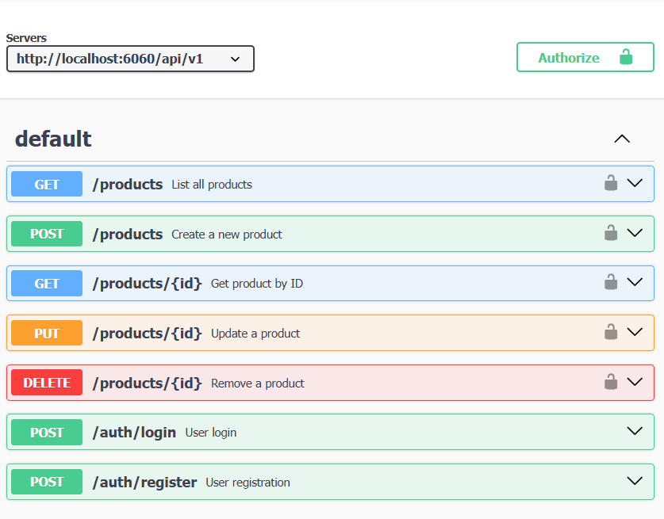

## Test Assignment for Software Engineer

**Start Api Project**

 ```bash
git clone https://github.com/nathakritbc/assignmentBackEnd.git
cd  assignmentBackEnd
npm install
npm start
```

## Verify project startup

**Once the server is running, the API endpoint will be available at <http://localhost:6060>. To modify environment variables, edit the .env file.**

 ```env
DB_HOST=147.50.231.18
DB_USER=jamestat_tato
DB_PASSWORD=1Ec%3c7v2
DB_NAME=jamestat_tato_db
DB_PORT=3306

PORT=6060
JWT_SECRET=aksdgakjshdaisuyiewyrowerowyeroklsjghlasgdfpasod8asd

```

## Run Test (Assignment 2)

 ```env
npx jest
 ```

## Api test Swagger 
go to <http://localhost:6060/api-docs>



## Posman file test api 

<a  href="./assignment_back_end.postman_collection.json"  download="assignment_back_end.postman_collection.json">download postman file</a>
 
